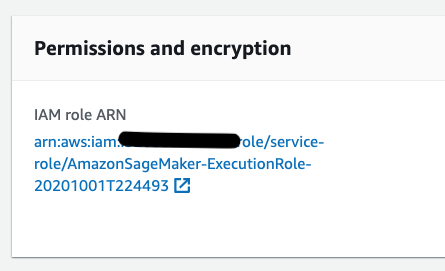
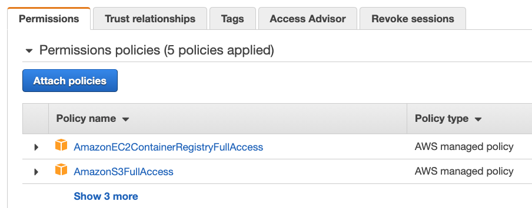

# Amazon SageMaker Ludwig Transformer

This repository provides an notebooks for training and deploying a Transformer based NLP model using the open source [Ludwig](https://github.com/uber/ludwig) AutoML deep learning framework built on TensorFlow.

### Dataset

We will train a multi-class model to classification review text with a rating in the range of `1-5`.  We will be using a huggingface pre-trained [yelp sentiment](https://huggingface.co/gilf/english-yelp-sentiment) model as part of our training and fine-tuning.

### Prerequisites

This notebook will [Build Your Own](https://docs.aws.amazon.com/sagemaker/latest/dg/docker-containers-adapt-your-own.html) Docker container.  So you will require some additional permissions for your notebook role to publish to Amazon Elastic Container Registry [ECR](https://docs.aws.amazon.com/AmazonECR/latest/userguide/what-is-ecr.html).

The easiest way to add these permissions is to add the managed policy to the role that you used to start your notebook instance in the SageMaker dashboard. To this end, open your notebook instance, go to the **Permissions and encryption** section to to navigate to the IAM role.

After you choose the role, you can attach the `AmazonEC2ContainerRegistryFullAccess` policy. There’s no need to restart your notebook instance when you do this, the new permissions will be available immediately.

### Notebooks

Launch the [train-ludwig.ipynb](train-ludwig.ipynb) notebook to begin.

This notebook will step you through the process of create three containers.

1. `ludwig-training` - The base container build on TensorFlow 2.3 which clones and installs the latest Ludwig source and Amazon SageMaker [Training Toolkit](https://github.com/aws/sagemaker-training-toolkit)
2. `ludwig-inference` - The container for hosting any Ludwig models leveraging the Amazon SageMaker [Inference Toolkit](https://github.com/aws/sagemaker-inference-toolkit)
3. `ludwig-reviews` - The reviews training container that extends `ludwig-training` with configuration transformer model.

You will shown how to train and evaluate the model before deploying to in local mode and launch [test-ludwig.ipynb](test-ludwig.ipynb) to evaluate different CVS and JSON payloads before deploying to an Amazon SageMaker hosting endpoint.

## License

This library is licensed under the MIT-0 License. See the LICENSE file.